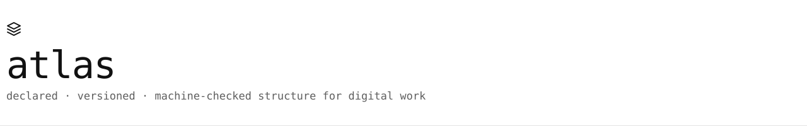
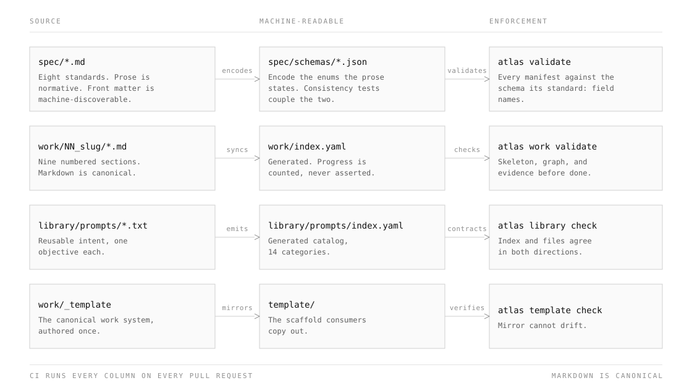

<picture>
  <source media="(max-width: 600px) and (prefers-color-scheme: dark)" srcset="assets/banner-compact-dark.svg">
  <source media="(max-width: 600px)" srcset="assets/banner-compact-light.svg">
  <source media="(prefers-color-scheme: dark)" srcset="assets/banner-dark.svg">
  
</picture>

# Atlas

Write down what "organized" and "finished" mean for your projects, then let one
command check every repository against it.

[](project.yaml)
[](docs/reference/quick-reference.md)
[](CHANGELOG.md)
[](docs/reference/versioning.md)
[](.github/workflows/ci.yml)
[](LICENSE)

Drawn from [`project.yaml`](project.yaml) by `python scripts/build_assets.py`, so a
badge cannot claim something the manifest no longer says (PRESENTATION P-07). The
dot carries status and the word beside it repeats the same fact, so the color is
never the only signal. Each badge links to the file that makes its claim true.

## What & Why

Two people look at the same repository and disagree about whether it is ready to
ship. One points at the passing tests. The other points at the missing runbook
and the owner who left in March. Both are looking at real evidence, and neither
can settle it, because nobody ever wrote down what ready means here.

Atlas writes it down. Eight short specifications state what must be true about a
piece of work: where its files live, what every repository contains, what kind of
project it is, when it is good enough, who may approve changes, how it describes
itself to the outside world, where shared assets go, and how the work itself is
planned and verified. The `atlas` command then checks a repository against all of
it and prints what is missing.

The value is that the argument moves. Instead of two people trading opinions
about readiness, they read twelve checks and a list of what failed. That works
whether or not you write code, which is the point: most of the people affected by
how a company organizes its work are not the people who build its tools.

This repository is **self-hosting**, meaning it passes the standard it defines,
and it doubles as a **template** you can start your own projects from.

New here and not a programmer? [`docs/reference/glossary.md`](docs/reference/glossary.md)
explains every term in plain language, and nothing below it assumes you have read
any code.

## Quickstart

Install the CLI:

```bash
pip install atlas-standard
```

Start a repository that already passes, and see where it stands:

```bash
atlas init payments-api ../payments-api
cd ../payments-api
atlas check
```

Open your first piece of work, then read the docs in a browser:

```bash
atlas work new harden-auth --owner person:you
atlas site serve
```

Working on Atlas itself, or without an install? Every command is also reachable
from a bare checkout:

```bash
scripts/atlas check
python -m pytest tests/ -q
```

## The CLI

One command operates every part of a repository. Typing `atlas` with no
arguments prints a help tree grouped by what you are trying to do, with a worked
example for each group, so you can find a command without reading the source.
Every command also accepts `--json`, and the exit codes tell a script the
difference between "this repository has violations" and "you typed the flag
wrong".

| Command | Does |
|---|---|
| `atlas init` | Start a new repository that already passes |
| `atlas status` | Show what this project is and where it stands |
| `atlas doctor` | Find out why something is not working |
| `atlas check` | Check this repository against the standard |
| `atlas validate` | Check that a manifest is filled in correctly |
| `atlas work` | Plan, track, and verify initiatives |
| `atlas spec` | Read the standards and cite their rules |
| `atlas prompt` | Find a written-once request to paste or hand over |
| `atlas library` | Inspect the shared prompts, icons, typefaces, and media |
| `atlas site` | Turn the docs into a website you can read |
| `atlas template` | Inspect and refresh the starter template |
| `atlas completion` | Print a shell completion script |

Full reference: [`docs/reference/cli.md`](docs/reference/cli.md). It is generated
from the argument parser itself, so it cannot describe a flag the tool lacks, or
omit one it has.

## Architecture

<picture>
  <source media="(prefers-color-scheme: dark)" srcset="assets/architecture-dark.svg">
  
</picture>

The prose in `spec/` is the standard. The JSON Schemas beside it encode the parts
a machine can check, and a set of consistency tests compares the two, so a value
added to one has to be added to the other. Each repository states its own facts
in a manifest (`project.yaml`, and `org.yaml` or `admin.yaml` for organizations).
The `atlas` package checks those facts, and `template/` plus `library/prompts/`
carry the shape and the working habits into each new project.

The tooling is a library first. Everything the CLI does can be imported from
`atlas.core` and `atlas.site` with no terminal involved, so one body of code
serves the command line, the test suite, and whatever you build on top.

## The eight standards

| Standard | Answers | Spec |
|---|---|---|
| **WORKSPACE** | Where does a file live? | [`spec/workspace.md`](spec/workspace.md) |
| **PROJECT** | What must be true inside a repository? | [`spec/project.md`](spec/project.md) |
| **MATRIX** | What kind of project is it? | [`spec/project-matrix.md`](spec/project-matrix.md) |
| **CHECKLIST** | Is it good enough? | [`spec/project-checklist.md`](spec/project-checklist.md) |
| **ADMIN** | Who may act, who answers, who pays? | [`spec/admin.md`](spec/admin.md) |
| **PRESENTATION** | How does it show itself? | [`spec/presentation.md`](spec/presentation.md) |
| **LIBRARY** | Where do shared assets live, and on what terms? | [`spec/library.md`](spec/library.md) |
| **WORKSTREAM** | What work is happening, by whom, and is it done? | [`spec/workstream.md`](spec/workstream.md) |

Each specification opens with a block of machine-readable metadata: its id,
version, status, rule prefixes, and companions. A tool can therefore discover
what the suite covers without reading the prose. Read a standard from the
terminal with `atlas spec show workstream`, or list every rule it defines with
`atlas spec show workstream --rules`.

## Work management

[`work/`](work/) holds every initiative in this repository, one numbered folder
each. All of them have the same nine sections in the same order: plan, tasks,
requirements, decisions, research, deliverables, validation, agents, and issues.
A fixed shape means a person joining on Tuesday and an AI agent picking up the
work on Wednesday both find the plan in `01_plan/` without asking anyone.

Open a workstream, then find out what is stuck and who owns it:

```bash
atlas work new migrate-the-fleet --owner person:you
atlas work list --status blocked
atlas work show 01 --tasks
```

Regenerate the dashboard and index after editing tasks, and check the result:

```bash
atlas work sync
atlas work validate
```

The Markdown is the original. [`work/README.md`](work/README.md), the dashboard
a person reads, and [`work/index.yaml`](work/index.yaml), the file an agent
reads, are both generated from the task tables. Progress is therefore counted
rather than claimed: a workstream cannot report itself further along than its
own task list says it is.

Repositories scaffolded from [`template/`](template/) get this system ready to
run. They install the published `atlas-standard` package instead of carrying
their own copy of the tooling, so they pick up fixes by upgrading rather than by
merging.

## Prompt library

[`library/prompts/`](library/prompts/) holds 78 written-once requests you can
paste into any AI assistant, or hand to a colleague, covering 14 stages of a
project's life: workspace, repository, architecture, documentation, github,
administration, quality, security, releases, maintenance, design, agents,
operations, and workstreams. Each is one to three sentences and asks for exactly
one thing. Anything that deletes or overwrites is worded to propose a plan first.

Find one, read it, then send it straight to the clipboard:

```bash
atlas prompt search release
atlas prompt show cut-release
atlas prompt show cut-release | pbcopy
```

## Repository layout

```
src/atlas/     the tooling: core logic, site generator, CLI (one importable root)
spec/          the product: eight standards + JSON Schemas
work/          every initiative as a numbered workstream + generated dashboard
library/       shared assets: prompts, icons, typefaces, media
template/      minimal compliant starter repository (mirrored, not hand-edited)
examples/      worked manifests, validated in CI
docs/          architecture, decisions (ADRs), guides, reference
tests/         schema, example, consistency, metadata, CLI, and site checks
scripts/       thin wrappers so a bare checkout works without an install
assets/        brand: banner, architecture diagram, design tokens
.github/       CI workflows, CODEOWNERS, templates, settings as code
```

## Documentation

**Start here**

- [`docs/guides/install.md`](docs/guides/install.md): install the CLI and run it
- [`docs/reference/glossary.md`](docs/reference/glossary.md): every term, in plain language
- [`docs/reference/quick-reference.md`](docs/reference/quick-reference.md): the suite on one page
- [`docs/reference/conventions.md`](docs/reference/conventions.md): how to name and place anything

**Doing something**

- [`docs/reference/cli.md`](docs/reference/cli.md): every command and flag
- [`docs/guides/new-project.md`](docs/guides/new-project.md): start a compliant project
- [`docs/guides/adoption.md`](docs/guides/adoption.md): adopt the standard in an existing repository
- [`docs/guides/work-management.md`](docs/guides/work-management.md): running the work system
- [`library/prompts/README.md`](library/prompts/README.md): the full prompt catalog

**Understanding it**

- [`docs/architecture/repository-design.md`](docs/architecture/repository-design.md): how the pieces fit and why
- [`docs/architecture/cli-design.md`](docs/architecture/cli-design.md): why the CLI is shaped this way
- [`docs/decisions/`](docs/decisions/): architecture decision records
- [`docs/reference/rule-ids.md`](docs/reference/rule-ids.md): how to cite a rule
- [`docs/reference/color-system.md`](docs/reference/color-system.md): where color is allowed, and why
- [`docs/reference/versioning.md`](docs/reference/versioning.md): release version vs standard version
- [`spec/schemas/`](spec/schemas/): JSON Schemas, the machine-readable half
- [`work/README.md`](work/README.md): the live work dashboard

## Status

`stage: active` · `maturity: stable` · `support: best-effort`. These three values
are copied from [`project.yaml`](project.yaml), which is where they are actually
defined. The repository's description, homepage, topics, and branch protection
rules live in [`.github/settings.yml`](.github/settings.yml) rather than in
GitHub's settings screens, so a change to any of them is reviewable.

The release version (`v1.0.0`) and the standard's contract version
(`project/1.0`) are separate numbers that move independently.
[`docs/reference/versioning.md`](docs/reference/versioning.md) explains which is
which and why conflating them causes trouble.

Forking this for your own organization? Replace `OWNER` in `project.yaml`,
`.github/settings.yml`, `CHANGELOG.md`, and `.github/CODEOWNERS` with your handle
or team, then run `atlas check`.

## Contributing / License

Contributions follow [CONTRIBUTING.md](CONTRIBUTING.md). Editorial changes merge
freely. A change to what the standard requires travels with its schema, version,
and changelog entry in a single change-set, so the contract and its enforcement
never disagree. Specifications are licensed [CC BY 4.0](LICENSE); tooling is MIT.
Security policy: [SECURITY.md](SECURITY.md).
