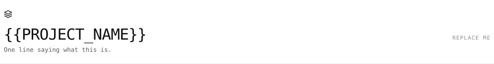

<picture>
  <source media="(max-width: 600px) and (prefers-color-scheme: dark)" srcset="assets/banner-compact-dark.svg">
  <source media="(max-width: 600px)" srcset="assets/banner-compact-light.svg">
  <source media="(prefers-color-scheme: dark)" srcset="assets/banner-dark.svg">
  
</picture>

# {{PROJECT_NAME}}

One line saying what this is and who it is for. Use the same sentence in
`metadata.description`, `.github/settings.yml`, and here: three places, one
sentence, checked by CI.

[](project.yaml)
[](project.yaml)
[](project.yaml)

These values are drawn from [`project.yaml`](project.yaml) by `python scripts/build_assets.py`.
Regenerate them when the manifest changes, and add
a badge only once its value is derivable from the manifest or from CI (P-07).

---

## What & Why

Three sentences at most. What problem this solves, for whom, and why it exists
rather than the obvious alternative. Assume the reader arrived from a search
result and knows nothing.

## Quickstart

The shortest copy-pasteable path to one working result. Keep it true or delete
it: a quickstart that fails is worse than none.

```bash
pip install atlas-standard   # the standard's tooling
atlas check                  # every compliance gate, on this repository
atlas status                 # what this project is, and where it stands
```

Then replace the three lines above with the real ones for this project.

## Documentation

| | |
|---|---|
| [`docs/`](docs/) | Architecture, decisions (ADRs), guides |
| [`work/`](work/) | Every initiative as a numbered workstream |
| [`AGENTS.md`](AGENTS.md) | How agents and new humans operate here |
| [`atlas --help`](https://github.com/OWNER/atlas) | The CLI that verifies all of it |
| [`CHANGELOG.md`](CHANGELOG.md) | What changed, and when |

## Status

`stage: incubating` · `maturity: experimental` · `support: none`

Mirrored from [`project.yaml`](project.yaml), the machine-readable source of
truth. Claim a higher maturity only when its CHECKLIST profile actually passes.

## Contributing / License

[CONTRIBUTING.md](CONTRIBUTING.md) · [LICENSE](LICENSE)

---

<details>
<summary><b>Scaffolding checklist: delete this section once done</b></summary>

1. **Manifest.** Set `type`, `owner`, and `visibility` in `project.yaml`, then
   `atlas validate project.yaml`.
2. **One sentence, three places.** Write the value proposition once; use it in
   `metadata.description`, `.github/settings.yml`, and under the title above.
3. **Banner.** Replace `assets/banner-light.svg` and `assets/banner-dark.svg`
   with a real hero visual: a screenshot or a diagram beats a wordmark.
   Keep the alt text meaningful (PRESENTATION P-02).
4. **Badges.** Two ship by default and both mirror `project.yaml`; update them
   when you change `stage` or `maturity`. Add more only once each value is
   derivable from the manifest or from CI (P-07): a badge nothing checks is a
   claim nothing checks.
5. **Commands.** Fill in build, test, and lint in `AGENTS.md`, and run them, so
   they are copy-paste true.
6. **CI.** Wire `.github/workflows/ci.yml`, then enable branch protection.
7. **First workstream.**
   `atlas work new <slug> --owner person:you`
8. Delete this checklist.

</details>
