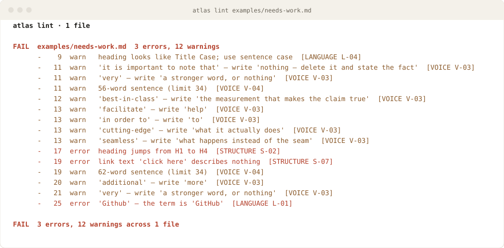
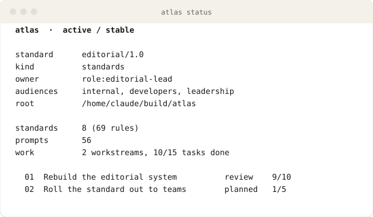
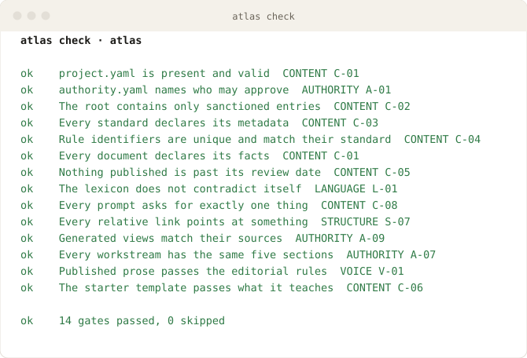

# Atlas

**Your company's writing rules, as a command you can run.**

Point it at a draft. It tells you what would fail review, cites the rule, and
gives you the line number.

<picture>
  <source media="(prefers-color-scheme: dark)" srcset="assets/demo-lint-dark.svg">
  
</picture>

Every line in that output is a rule somebody agreed to, in a file you can edit.
Nothing is a matter of taste that the tool decided for you.

```bash
pip install atlas-editorial
atlas lint drafts/announcement.md
```

[](project.yaml)
[](docs/reference/quick-reference.md)
[](CHANGELOG.md)
[](docs/reference/versioning.md)
[](.github/workflows/ci.yml)
[](LICENSE)

## What you get

| If you | Atlas gives you |
|---|---|
| **Write** | A second opinion in two seconds, before anyone else sees the draft |
| **Review** | The mechanical half already done, so you spend attention on the argument |
| **Own a docs set** | Every page with a named owner and a review date, and a list of what has gone stale |
| **Run an editorial team** | Style decisions in one file, enforced in CI, instead of re-argued every week |
| **Work with AI drafts** | Rules an assistant can follow and be checked against, in `AGENTS.md` and `spec/` |

## Why this exists

Style guides get read once and cited never. So the same three corrections come
back in every review, and two people disagree about whether a draft is ready.
One is looking at the argument, which is sound. The other is looking at the
missing owner and the claim with no number behind it. Neither can settle it.

Atlas writes down what *ready* means. Eight short standards say what must be
true of a piece of company writing, from how it sounds to who may approve it.
Then two commands check it:

| Command | Asks |
|---|---|
| `atlas lint` | Is this **document** ready? 11 rules over one file, a folder, or what your branch changed |
| `atlas check` | Is this **repository** in order? 14 gates over ownership, freshness, links, and manifests |

Errors are rule violations and fail the run. Warnings are judgement calls — a
34-word sentence may be the right sentence, and you are allowed to keep it.
Everything a machine cannot fairly decide is left to a reviewer, deliberately.

## 60-second tour

Start a content repository that already passes:

```bash
atlas init brand-guidelines ../brand-guidelines --owner role:brand-lead
cd ../brand-guidelines
atlas check
```

Ask where you stand:

<picture>
  <source media="(prefers-color-scheme: dark)" srcset="assets/demo-status-dark.svg">
  
</picture>

Look a house term up, find a written-once prompt, open a piece of work:

```bash
atlas lexicon find email          # how do we spell it, and why
atlas prompt show write-brief     # paste into any assistant
atlas work new launch-messaging --owner person:you
```

## The eight standards

| Standard | Answers | Spec |
|---|---|---|
| **VOICE** | How does the company sound? | [`spec/voice.md`](spec/voice.md) |
| **LANGUAGE** | Which words, names, and mechanics? | [`spec/language.md`](spec/language.md) |
| **STRUCTURE** | How is a piece of writing shaped? | [`spec/structure.md`](spec/structure.md) |
| **CONTENT** | What must be true of a piece of content? | [`spec/content.md`](spec/content.md) |
| **MATRIX** | What kind of content is it, and what does it require? | [`spec/matrix.md`](spec/matrix.md) |
| **CHECKLIST** | Is it ready to publish? | [`spec/checklist.md`](spec/checklist.md) |
| **AUTHORITY** | Who may write, review, approve, and retire? | [`spec/authority.md`](spec/authority.md) |
| **PUBLICATION** | How does it show itself, and where does it go? | [`spec/publication.md`](spec/publication.md) |

69 numbered rules in total. A review comment can cite `V-05` and the writer
knows exactly which sentence to open:

```bash
atlas spec show voice --rules
atlas spec rules --grep evidence
```

Each standard opens with machine-readable metadata, so a tool can discover what
the suite covers without reading the prose. They ship inside the package too —
`atlas spec show voice` works from any repository, not only this one.

## The lexicon

[`library/lexicon/terms.yaml`](library/lexicon/terms.yaml) is the one place that
says how we spell our names and which habits of writing we have decided against.
The linter reads it directly, so changing the house style is a one-line change
to one file, enforced everywhere on the next run.

```yaml
- id: front-matter
  use: front matter
  avoid: [frontmatter, front-matter]
  severity: error
  note: "Two words, as in typesetting."

- {avoid: in order to, use: to, reason: "the extra words carry nothing"}
```

Seed it with the corrections you have already made by hand twice. That is the
whole trick: it stops being your job.

## The CLI

One command operates every part of a repository. Typing `atlas` with no
arguments prints a help tree grouped by what you are trying to do. Every command
accepts `--json`, and the exit codes tell a script the difference between "this
has violations" and "you typed the flag wrong".

| Command | Does |
|---|---|
| `atlas init` | Start a new repository that already passes |
| `atlas status` | Show what this project is and where it stands |
| `atlas doctor` | Find out why something is not working |
| `atlas check` | Check this repository against the standard |
| `atlas lint` | Check a document against the editorial standards |
| `atlas validate` | Check that a manifest is filled in correctly |
| `atlas spec` | Read the standards and cite their rules |
| `atlas prompt` | Find a written-once request to paste or hand over |
| `atlas lexicon` | Look up a term or a phrasing decision |
| `atlas work` | Plan, track, and verify editorial work |
| `atlas completion` | Print a shell completion script |

Full reference: [`docs/reference/cli.md`](docs/reference/cli.md). It is generated
from the argument parser itself, so it cannot describe a flag the tool lacks, or
omit one it has.

## Repository checks

<picture>
  <source media="(prefers-color-scheme: dark)" srcset="assets/demo-check-dark.svg">
  
</picture>

Fourteen gates, each a named object you can run alone with
`atlas check --only content-declared`, each reporting the rule it enforces.
This repository passes all of them — it is **self-hosting**, which is the only
honest way to publish a writing standard.

## Prompt library

[`library/prompts/`](library/prompts/README.md) holds 56 written-once requests
covering 14 stages of a piece of writing: brief, research, drafting, structure,
editing, voice, terminology, accessibility, localisation, review, publication,
maintenance, measurement, and agents. Each asks for exactly one thing in no more
than four sentences, and anything that changes files proposes a plan first.

```bash
atlas prompt search review
atlas prompt show write-brief | pbcopy
```

## Work management

[`work/`](work/) holds every editorial initiative, one numbered folder each, all
with the same five sections: brief, tasks, drafts, review, publication. A fixed
shape means a person joining on Tuesday and an agent picking the work up on
Wednesday both find the brief in `01_brief/` without asking anyone.

The task table is the original. [`work/README.md`](work/README.md), the
dashboard a person reads, and `work/index.yaml`, the file an agent reads, are
both generated from it. Progress is counted rather than claimed: a workstream
cannot report itself further along than its own task list says it is.

## Repository layout

```text
spec/          the product: eight standards + JSON Schemas
src/atlas/     the tooling: core library, then a CLI on top of it
library/       shared assets: the lexicon, the prompts, content templates
work/          every initiative as a numbered workstream + generated dashboard
template/      minimal starter repository that passes what it teaches
examples/      worked manifests and a before/after draft, validated in CI
docs/          guides, reference, architecture, decisions
tests/         self-hosting, schema, linter, CLI, and template checks
scripts/       thin wrappers and generators for a bare checkout
assets/        badges and terminal demos, generated from real command output
@removal-safe/ the archived predecessor repository, temporary and exempt
```

## Documentation

**Start here**

- [`docs/guides/install.md`](docs/guides/install.md): install the CLI and run it
- [`docs/reference/glossary.md`](docs/reference/glossary.md): every term, in plain language
- [`docs/reference/quick-reference.md`](docs/reference/quick-reference.md): the suite on one page
- [`docs/reference/conventions.md`](docs/reference/conventions.md): how to name and place anything

**Doing something**

- [`docs/guides/writing-a-document.md`](docs/guides/writing-a-document.md): from brief to published
- [`docs/guides/new-project.md`](docs/guides/new-project.md): start a content repository
- [`docs/guides/adoption.md`](docs/guides/adoption.md): adopt this where content already exists
- [`docs/guides/work-management.md`](docs/guides/work-management.md): running the work system
- [`docs/reference/cli.md`](docs/reference/cli.md): every command and flag

**Understanding it**

- [`docs/architecture/repository-design.md`](docs/architecture/repository-design.md): how the pieces fit and why
- [`docs/architecture/cli-design.md`](docs/architecture/cli-design.md): why the CLI is shaped this way
- [`docs/decisions/0001-eight-standards.md`](docs/decisions/0001-eight-standards.md): the decision records
- [`docs/reference/rule-ids.md`](docs/reference/rule-ids.md): how to cite a rule
- [`docs/reference/versioning.md`](docs/reference/versioning.md): release version against standard version

## Status

`stage: active` · `maturity: stable` · `support: maintained`. Those three values,
and the badges above, are drawn from [`project.yaml`](project.yaml) by
`python scripts/build_assets.py`, so a badge cannot claim something the manifest
no longer says. The terminal images are generated by running the commands and
capturing what they print, so a screenshot cannot show a result the tool does
not produce.

The release version (`v1.0.0`) and the standard's contract version
(`editorial/1.0`) are separate numbers that move independently.
[`docs/reference/versioning.md`](docs/reference/versioning.md) explains which is
which, and why conflating them causes trouble.

> **Important**
> Forking this for your own organisation? Replace `OWNER` in `project.yaml`,
> `.github/settings.yml`, and `.github/CODEOWNERS` with your handle or team,
> replace the principals in [`authority.yaml`](authority.yaml), then run
> `atlas check`.

## Contributing

Contributions follow [CONTRIBUTING.md](CONTRIBUTING.md). Editorial changes merge
freely. A change to what the standard *requires* travels with its schema, its
version, and its changelog entry in a single change-set, so the contract and its
enforcement never disagree.

## License and security

The standards in `spec/` are licensed [CC BY 4.0](LICENSE); the tooling is MIT.
Report vulnerabilities as described in [SECURITY.md](SECURITY.md).
